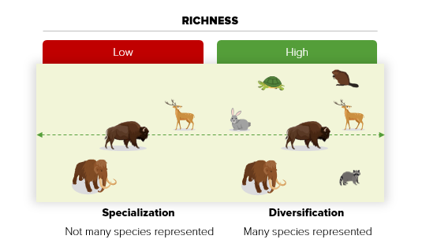
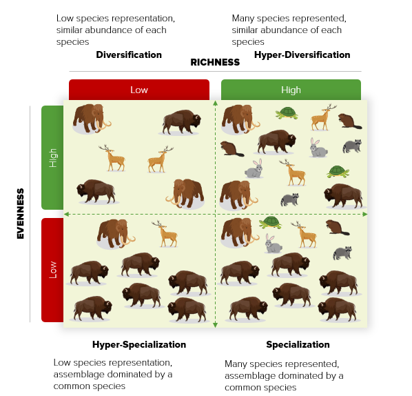

## \hfil GREAT PLAINS CULTURES AND PALEOENVIRONMENT\hfil
This study expands on our earlier work examining the processes and resulting patterns of animal use across the Great Plains and adjacent regions during the Paleoindian period in the context of the longer-term cultural history of the area. In particular, we assess whether the apparent habitat differences in prey choice observed during the Paleoindian period are present later by tracking changes in the long-term foraging practices of peoples on the Great Plains. The archaeological record of this region covers a 13,500-year period of significant climatic and environmental changes. We discuss the degree to which shifts in human demography, mobility, and technology affected subsistence practices geared toward the intensification of resource production.

Before European settlement, a complex series of grassland plant and animal communities inhabited the North American Great Plains. The story of these biological communities began during the grassland expansion that occurred approximately 5–7 million years ago. Increased climatic aridity catalyzed this shift during the Miocene–Pliocene transition. The resulting decline in woodlands promoted an increased abundance of C4 grasses and facilitated the coevolution of mammals adapted to grazing and open habitats [@anderson_evolution_2006; @axelrod_rise_1985; @mack_evolution_1982]. These factors shaped the composition of the Great Plains grasslands’ biological communities and their organismal characteristics. Particularly crucial to the evolution of human occupation in this region, the Plains hosted the coevolution of a mutually beneficial relationship between large mammal grazers and primary producers [grasses]. At least as far back as the Pleistocene–Holocene transition, the structure of this and other community interactions varied according to the Great Plains’ west to east precipitation cline and its north to south temperature gradient [@kuchler_potential_1965; @tieszen_ndvi_1997].

Tallgrass or mixed-grass prairies occurred across most of the eastern Plains. Greater precipitation trends along the eastern borders of the Plains supported tallgrass prairie grasses intermixed with oak, walnut, and hickory woodlands. Mixed-grass prairies and some gallery forest along major riverways covered the central Plains [Iowa, Missouri, Kansas]. The western portion of the Plains became true shortgrass prairies, stretching to the front range of the Rocky Mountains [@coupland_overview_1992; @kuchler_potential_1965; @tieszen_ndvi_1997; @weaver_prairie_1968]. A high degree of spatial and temporal variability in climatic conditions over time influenced the distribution of vegetation and fauna, and instigated dramatic shifts in human land use and subsistence activities. 

The gradients of temperature and precipitation on the Great Plains mean that the northwestern portions are generally cooler and drier. In comparison, the southern and eastern portions are generally warmer and wetter [@tieszen_ndvi_1997]. This environmental variation underlies a gradient of grass adaptation, most notably reflected in the morphological cline ranging from tall to short grass species. Such evolutionary adaptations shaped an inverse relationship between grass height and the total edible portion of the grass [@frank_consumer_2002; @frank_evidence_1993; @frank_ecology_1998; @mcnaughton_grazing_1984]. As a result, the western short grasses of the High Plains likely supported higher concentrations of large grazers than the mixed-grass or tallgrass prairies [@frank_evidence_1993; @otarola-castillo_spatio-temporal_2016]. Except in times of extreme drought, hunters would have likely found the High Plains region to be the most productive big prey hunting area. After horticulture emerged in this region, the wetter and warmer conditions, including the higher levels of nitrogen in the soil, made the tallgrass prairie and eastern mixed-grass settings more attractive for dryland farming [@lauenroth_structure_1999].

Native cultures have existed on the Great Plains since at least 13,300 years ago, although claims that occupations of the Plains and adjacent areas took place as much as 15,000 years ago are currently being debated [@miller_colonization_2018; @waters_late_2019]. The first archaeological period [Paleoindian] on the Great Plains dates from approximately 13,300–8000 years ago. Paleoclimatic research of the Great Plains suggests that the Paleoindian period was generally cooler than later in the Holocene, with higher effective moisture and a high frequency of fluctuations in temperature regimes [e.g., @dansgaard_one_1969; @williams_nitrogen_1998]. Following the retreat of the Laurentide glacier in roughly 8000 BP, the eastern portion of the northern Plains saw a gradual transition from largely parkland vegetation to a mixed-grass savanna. Temperate grassland vegetation covered the northwestern Plains, including more scattered forests and parklands [@betancourt_late_2001; @dean_holocene_2000; @yansa_holocone_1998, @yansa_timing_2006]. In the southern Plains, although some eastern regions have shown evidence of forests [especially before about 9000 BP], grasslands or savanna conditions dominated most of the region, except with some scattered trees in well-water valleys [@balinsky_pleistocene_1998; @betancourt_late_2001; @bousman_paleoenvironmental_1998; @fredlund_holocene_1998; @holliday_stratigraphy_1995; @johnson_lubbock_1987; @theler_paleoenvironmental_2003]. 

Groups living during this period maintained high degrees of residential mobility, but exhibited significant technological and economic differences from one another compared to in later periods. There is a paucity of direct archaeological evidence for the use of plants or the presence of plant processing equipment [@adair_patterns_2011; @blackmar_paleoarchaic_2006]. Some Clovis-age Plains sites have yielded evidence of human artifacts in direct association with remains from extinct species, including mammoth, mastodon, bison, camels, and horses, suggesting that human predation may be one factor contributing to the loss of those animals in North America [@broughton_population_2018; @meltzer_pleistocene_2015; @surovell_human_2009; @widga_early_2004]. 

A research question that has generated much attention is whether Great Plains Paleoindians specialized in hunting big game. While there is little consensus on this topic, it is empirically challenging to rigidly categorize Paleoindian groups as solely specialized or generalized foragers, as evidence across sites shows substantial use of large, medium, and small prey. It is likely most appropriate to characterize these foragers as having practiced a seasonally and geographically flexible economy [@cannon_explaining_2008; @deangelis_evaluation_2018; @hill_causes_2007a, @hill_variation_2008; @kornfeld_are_2007; @kornfeld_bonebeds_2008; @surovell_how_2008]. However, with the extinction of the Pleistocene megafauna, bison became the primary large-body prey, and archaeologists have discovered numerous single- and repeat-event bison kill localities across the Plains [@bozell_native_2011]. Bison hunting was a year-round activity, with most kills being relatively small in size and probably organized and executed by a single extended family [@hill_sticking_2013]. Nonetheless, some Paleoindian groups, like the Cody complex, were skilled at conducting enormous, likely communal bison kills [>100 animals], at least on occasion [@bamforth_origin_2011; @hill_sticking_2013; c.f. @hofman_paleoindian_1994]. 

The early to middle Holocene drying appears to have been a significant climatic event. The warmer, drier conditions led to the increasing dominance of drought-tolerant grasslands covering much of the Plains. Primarily during severe drought, bare areas may have formed on the upland surface vegetation. Especially in central and southern regions of the Great Plains, the loss of surface vegetation resulted in massive eolian sedimentation and alluvial downcutting during this period [@bettis_iii_effects_2002; @forman_temporal_2001; @halfen_review_2013] Drought conditions also resulted in significant declines in the availability of surface water. In the Northeast, this often resulted in the appearance of more brackish wetlands, while in the south and far west, many springs and streams disappeared [@holliday_stratigraphy_1995; @johnson_lubbock_1987].

Starting around 6000 BP [and established by about 4000 BP], conditions across the Great Plains became cooler and wetter – conditions that have continued to modern times [@barnosky_postglacial_1989; @clark_drought_2002]. The expression and timing of this climatic amelioration varied across the region. In the dry western Plains, increased precipitation reactivated spring-fed streams and marshes around 4500 BP. In the northern Plains, increased precipitation meant that short-grass prairie vegetation cover was sufficient to cease or at least dramatically slow soil erosion during the late Holocene. Despite the cooler and wetter conditions of this period, the late Holocene exhibited cyclical wet–dry periods. Some of the drought periods were quite severe and multidecadal, even lasting a century [@clark_drought_2002; @halfen_review_2013; @shuman_structure_2016]. These extended drought periods were so intense that they reactivated dune fields and increased eolian activity. In the warmer and drier central and southern plains, these droughts contributed to severe erosion in the small alluvial valleys, which would then aggregate in the more extensive alluvial valleys [@bettis_iii_effects_2002; @robertson_reassessing_2011]

Researchers have argued that generalized hunting-gathering economies characterized the Archaic period [8000–2000 BP], with increasing regional differences in terms of technology, subsistence, and mobility. In many parts of the Great Plains, the Archaic economies and lifeways differed greatly from those of Paleoindian groups [@blackmar_paleoarchaic_2006; @frison_northwestern_1998a, @frison_paleoindian_1998b]. Unlike in the Paleoindian period, however, periodic droughts during the Archaic may have resulted in the depleted use or even abandonment of the driest portions of the plains [@meltzer_human_1999]. Bison procurement of mostly cow-calf herds continued throughout this period across much of the plains [@frison_northwestern_1998a, @frison_hunting_2001; @johnson_lubbock_1987; @widga_early_2004, @widga_bison_2006]. Mass communal kills were often conducted with the addition of jumps, arroyo traps, or surrounds, mostly in the northwest and southern Plains [@byerly_bonfire_2005; @frison_kobold_1970, @frison_northwestern_1998a, @frison_hunting_2001; @lobdell_scoggin_1973; @mulloy_mckean_1954]. At least 5000 years ago, these large-game hunters began to extract bone grease from carcasses [@walker_gowen_1992]. Bison were, of course, not the only prey used by Archaic groups; evidence has indicated the importance of deer, pronghorn, elk, fish, rabbits, rodents, reptiles, and mussels in the diet, although these might have functioned as secondary resources [@ahler_archeology_1995; @dyck_hunting_2001; @haury_analysis_2005; @schmits_coffey_1978; @widga_early_2004].

On the eastern portions of the Plains, Archaic groups demonstrated a higher degree of sedentism and more complex and diversified adaptions than other Plains Archaic groups [@adair_patterns_2011: 309; @kay_central_1998]. Archaic groups introduced new technologies to the Great Plains, including bone and clay beads [@schmits_coffey_1978; @thies_archeology_1990], clay effigies [@witty_slough_1982], fiber-tempered ceramics [@reid_nebo_1983], chipped stone harvesting tools [@witty_slough_1982], grinding stones, and earth ovens. Evidence for the use of plants became increasingly more common than in earlier periods, especially in the eastern Plains during the Archaic [@adair_plains_2006; @adair_patterns_2011; @kay_central_1998].

The Woodland period [2500–1000 BP] was a time of major regional social and economic innovation. Indigenous people across much of the Plains began to make and use ceramic vessels regularly, enabling improved efficiency in cooking and grease extraction. Other economic shifts occurred as people gradually switched from the atlatl to the bow-and-arrow and added the cultivation of domesticated plants to their repertoire of wild plant foods [@adair_patterns_2011; @johnson_plains_1998]. Population size and residential sedentism significantly increased during the Woodland, especially in the eastern Plains. People became more socially integrated during this period. This greater group cohesion is indicated by the communal use of burial mounds and extensive sharing of technologies, symbols, and rituals [@adair_refining_2012; @adair_patterns_2011].

In the drier western and the northern Plains, some groups remained aceramic societies that continued to extensively use bison and pronghorn [@bozell_native_2011; @frison_northwestern_1998a, @frison_hunting_2001; @johnson_lubbock_1987; @kehoe_gull_1973]. In the far northwest, several Woodland sites, such as Head-Smashed-In, Gull Lake, and Wardell, reflect intensive and repeat mass harvesting of bison. At sites like these, very large, stratified bison bonebeds have been found at the base of cliff faces or associated with corral structures [@frison_survival_2004; @kehoe_gull_1973; @kornfeld_prehistoric_2010]. In the east, groups adopted a horticultural economy, became less mobile, and hunted fewer bison. However, they consumed a substantially broader diet of medium- and small-bodied animals. In these areas, Woodland people consistently exploited a wide range of taxa in their diets, including low-ranked fish, birds, turtles, and various small mammals, alongside larger prey such as deer and bison [@wismer_hunt_2018]. Common elements at many Woodland sites were stone-filled pits and hearths associated with roasting and cooking meat and grease extraction. 

In the last 1000 years of prehistory, a diverse array of Late Prehistoric groups appeared across the Plains, characterized by considerably larger population sizes. Late Prehistoric people were more dependent on agriculture than their earlier Woodland counterparts. However, they used similar native seed crops and introduced new cultigens [maize, bean, squash]. Late Prehistoric sites reflect a high level of sedentism, usually marked by the construction of large houses used year-round and a greater intensity of farming. Initially, farming communities were small, ranging from individual farmsteads to hamlets. Later, many people organized into large permanent villages. Ceramic technology became prominent, serving multiple functions [e.g., cooking, storage] and beginning to reflect regionally distinct technological traditions. These societies were largely economically self-sufficient, but often participated in extensive exchange networks involving groups within and outside the Plains.

Despite the importance of agriculture, with few exceptions, hunting was still an essential part of Late Prehistoric economies. Massive bison kills took place, especially in the northwestern Plains. Although communal hunts were probably not utilized everywhere, nonetheless, bison continued to be a central part of the subsistence across most of the Plains [@bozell_native_2011]. Later groups developed a dual economic system composed of hunting and farming, organizing logistical parties for the long-distance hunting of bison scheduled around the planting and harvesting seasons. However, most hunting probably focused on more locally available resources, including deer and elk, combined with the use of a diversity of smaller prey, including rabbits, turtles, dogs, furbearers, rodents, and a variety of fish. In this context, the central Plains tradition in Kansas and Nebraska seems unique, as these groups relied on a generalized broad-spectrum economy; there is minimal evidence for the use of bison, except at localities in the High Plains. 

In the next section, we introduce our framework for characterizing Great Plains’ peoples dietary strategies. We use this framework to develop predictions on the level of specialization and diversification expected across habitats [alluvial valleys, plains and rolling hills, and foothills and mountains] and time periods [Paleoindian, Archaic, Woodland, and Late Prehistoric].

### \hfil DIVERSIFICATION AND SPECIALIZATION ON THE GREAT PLAINS\hfil
In general, behavioral signatures of diversification and specialization indicate a variable investment in “hardware” and “software.” Hardware may consist of novel food procurement technologies, for example, storage or prey capture facilities, development and use of nets, or new hunting equipment. Software refers to culturally normalized strategies for increasing food production, such as prey mass capture events, increased labor inputs, divisions of labor by age and sex, degree of carcass processing, resource-life extension through storage, and the logistical organization of labor to resolve scheduling conflicts [@reitz_zooarchaeology_1999]. 

Dietary diversification and specialization strategies are likely the result of a continuum of subsistence behaviors. We assume that if small-scale societies practice such strategies, their archaeological record will reflect secular trends in their subsistence behaviors. Researchers have characterized these trends using sophisticated methods to account for the number of species [species richness] and the abundance of each species included in the diet [species evenness]. For example, Figure 1 illustrates a simple one-dimensional gradient of low to high species richness. This figure visualizes the trend of an idealized forager diet focused on large-animal specialization [low diversity] versus one in which there is an increase in dietary diversification [high diversity]. However, by not accounting for evenness, Figure 1 might mask a pattern of specialization and characterize it as diversification. In Figure 2, the specialization–diversification continuum remains, but we add each species’ abundance, characterized by evenness, as an additional axis to this space, creating four possible dietary configurations.

$\underline{\text{Specialization}}$. Here, we call specialization an assemblage exhibiting a pattern of high richness and low evenness. Although hunters target several species, there is a clear predominance of a single species or size-class. 

$\underline{\text{Hyper-Specialization}}$. We refer to hyper-specialization as the pattern characterized by low richness and low evenness. In this case, the low species representation is not only dominated by a single species but can also be a single species.

$\underline{\text{Diversification}}$. We define diversification here to be assemblages that exhibit high evenness but low species richness. Evenness values show greater uniformity of hunting effort. This pattern no longer shows dominance by a single species or taxon, and even in low species representation, there is a tendency for equal species abundance. 

$\underline{\text{Hyper-Diversification}}$ refers to a pattern of high evenness and high richness. This pattern of "jack of all trades, master of none" shows no apparent preference for any single species or taxon. High evenness values signify an equal abundance of all species represented, perhaps signifying hunting mastery of all species in the diet. 

```{r echo=FALSE, fig.align = 'center', fig.cap = "Graphic depiction of variation in prey richness in an idealized forager’s diet on a one-dimensional gradient from a specialized diet focused on large game to one with high prey diversification"}

```

```{r echo=FALSE, fig.align = 'center', fig.cap = "Graphic depiction of variation in prey richness and evenness. This “diversification space” illustrates the in an idealized forager’s diet on a two-dimensional gradient from a hyper-specialized diet composed of low species representation and dominated by the large game, to a diet that is hyper-diversified representing many species at a similar abundance."}

```

The literature shows that there has been limited systematic and quantitative work on changes in long-term animal use across the Great Plains [e.g., @bozell_native_2011; @johnson_late_1986, @johnson_lubbock_1987; @semken_jr_late_1987]. Despite this limitation, we expect there to be a trend of increasing dietary diversity among Great Plains hunters, as outlined above. The prehistoric people who lived on the North American Great Plains experienced a remarkable range of climatic, environmental, and cultural variability over the last 13,000 years. There is good reason to expect that their archaeological remains can track fundamental changes in human–animal interactions through time. We anticipate that Paleoindian and Archaic foragers had more specialized economies. The traditional perspective is that Paleoindians made extensive use of mammoth and bison. However, they also included a wide variety of lower ranked resources in their diet, depending on the season and habitat. 

The increasing temperatures and drought conditions during the Holocene Climatic Optimum likely negatively affected the natural abundance of large ungulates such as bison. We expect that this significant climatic change would have made it difficult to sustain heavy predation on bison across the region. In places where bison or other large game were less affected, Archaic groups likely maintained a fairly specialized diet; however, in places most affected by drought, we anticipate that hunters would have either abandoned these regions and/or increased their dietary diversification by increasingly procuring more readily available small animals.

The last few millennia likely witnessed a rebound of bison populations as more mesic conditions became established across the region. This recovery potentially caused a resurgence of bison hunting during the Woodland and Late Prehistoric periods. However, the economies of Woodland groups would have had to respond to increased population pressure and sedentism far beyond anything prior groups had experienced. This demographic packing probably amplified predation pressure on crucial prey. Hunters likely responded by further increasing the diversity of species in their diets and more evenly hunting all prey available. We therefore expect that the Woodland economies were the most diverse compared to the other periods, with small mammals, birds, and aquatic resources becoming more common in people’s diets. However, the expected increase in bison on the landscape would have still made it quite attractive to hunt large prey, if small family groups could find ways to manage the competing labor demands of gathering wild plants, managing their horticultural pursuits, and making hunting forays increasingly farther away from human settlements. 

The Late Prehistoric period witnessed a further increase in population sizes and the formation of aggregated settlements. In places across the Great Plains, Late Prehistoric groups were likely intensive agriculturists living in large, permanent villages. Under these demographic and land use conditions, we anticipate that hunting took on a dual nature, as hunters specialized in large and small prey alike. Large-prey hunting likely became more critical, especially seasonally; however, due to technological developments [e.g., bow and arrow] and social reorganization [e.g., a division of labor by age and sex], these groups likely also relied heavily on a broad spectrum of lower ranked resources. Simultaneously, as settlements became more tethered to particular plots of land where farming was possible, the emphasis would have been on local resources. At the same time, it is also possible that the increasing social complexity and intergroup cooperation and competition among Late Prehistoric populations may have prompted some society members to undertake the increasingly inefficient and risky task of acquiring bison, despite the high risk of mortality and failure, and low caloric returns involved in such strategies [@smith_why_2004; @wiessner_hunting_2002].
