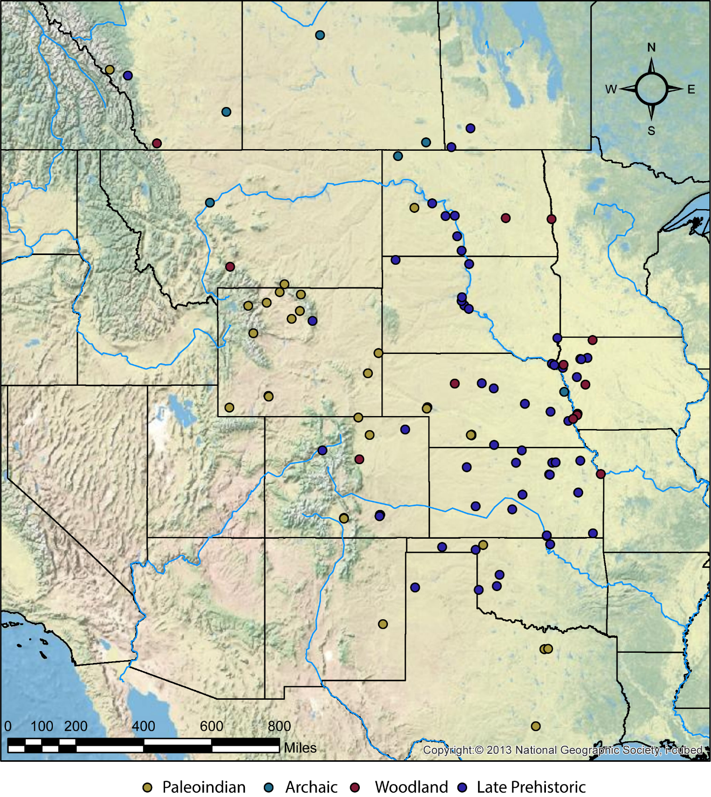

## \hfil MATERIALS AND METHODS\hfil

The current study examines faunal use at one of the largest geographic and spatial scales possible: trends across generations of multiple local groups. As noted previously [@cannon_explaining_2008; @moss_understanding_2012], the best approach to studying subsistence change is by determining how contemporary sites within a settlement function with resource variability. We accept that this large scale limits our ability to consider the effects of localized or, in some cases, even regional climatic and environmental changes on subsistence practices. We do not question the value of studies focusing on resource use within locally specific ecological, social, and historical frameworks; however, our study tries to consider large-scale trends in order to understand the full range of subsistence strategies. Organizing our analysis of faunal use around habitat setting differences is an attempt to factor in the natural effect that variation in resource availability might have had on the prey choice decisions of contemporary foragers. 

Our project collected data on taxa abundance from 204 archaeological components from 116 archaeological sites across the Great Plains and the adjacent Rocky Mountains. Sites used in this study range in age from approximately 13,477 to 300 cal. BP, with geographic distribution across all the major zones of the Great Plains and adjacent Rocky Mountains and its foothills (Figure 3). These data were derived primarily from published reports [see discussion of methods in @hill_moveable_2007b; @hill_variation_2008; @otarola-castillo_spatio-temporal_2016]. We used only assemblages from residential camp localities because assemblages from special-use kill localities would likely have biased the sample toward a focus on large fauna. We expect kills to lack the dietary variation anticipated at residential camps. We followed the site function definitions established by @sellet_dynamic_1999 and @wheat_olsen-chubbuck_1978, and followed @hill_variation_2008's criteria system for assigning sites to different habitats (alluvial valleys, plains and rolling hills, and foothills and mountains). We determined temporal associations (Paleoindian, Archaic, Woodland, and Late Prehistoric) for each assemblage using available dates and the presence of diagnostic artifacts. We chose habitat designations to reflect the key environmental zones exploited by past foragers and farmers, which differ in terms of resource productivity (e.g., patch caloric returns) and predictability [@knell_organization_2007; @kornfeld_affluent_1997]. As discussed previously [@hill_cody_2013; @knell_linking_2012], foragers and farmers would have found habitats to be quite different in terms of resource availability, abundance, and seasonal and spatial predictability. Mountains and foothills and alluvial valleys were likely calorie-rich areas with highly predictable and abundant biotic resources, and good sources of valuable abiotic resources (i.e., water, wood, and tool stone). By contrast, plains and rolling hills would have had a low abundance of biotic resources that were temporally and spatially unpredictable and critical abiotic resources that were spaced far apart. 

```{r echo=FALSE, fig.align = 'center', fig.cap = "Map of the Great Plains and adjacent Rocky Mountains, including site locations for the archaeological components used in this study"}

```

In total, the sites used in this study contained 459,122 faunal specimens, including unidentified fragments. For our study, this dataset contained 332,099 specimens that could be quantified as Number of Identified Specimens (NISP), of which more than 176,364 (53%) were identified to genus or finer taxonomic distinction. Following the general criteria outlined by @grayson_clovis_2002 and @cannon_explaining_2008, we included only faunal remains that showed unequivocal evidence of human butchery and consumption or were reported to be associated with cultural features or deposits.

We utilized three diversity measures to investigate multiple aspects of diet breadth in this study. The Margalef Diversity Index (D~Mg~) [@clifford_introduction_1975] is a simple richness measure that attempts to compensate for sample size differences by dividing the number of species present (S) by the total NISP in the assemblage (N), using the following equation(@magurran_measuring_2004: 77):

$$D_{Mg} = \frac{s-1}{ln(N)}$$

An increase in D~Mg~ indicates that a greater number of species are being consumed, which indicates a lack of specialization in the diet. 

To explore the degree of hunting focus on any single species or group of species, we used the Simpson’s Index(D') [@levins_evolution_1968; @simpson_measurement_1949]. This index is calculated using the formula: 

$$D' = \sum\left(\frac{n_{i}(n_{i}-1}{N(N-1)} \right)$$

where n~i~ is the abundance of taxon i, and N is the total number of individuals (specimens) in the assemblage (@magurran_measuring_2004: 115). Because D' decreases as evenness increases, we express the Simpson's Index as: 
	$$1-D'$$
	
[@faith_measurement_2018: 1428] note that, of various evenness measures used by zooarchaeologists, the Simpson's Index (1- D') is superior because it is relatively insensitive to changes in richness and it has greater power to detect minor changes in evenness. 

The final measure used was the Abundance Index (A.I.) [e.g., @bayham_factors_1979; @broughton_declines_1994a; @szuter_sedentism_1989]. The A.I. value is calculated by combining NISP counts for all taxa within established body size classes [i.e., @brain_hunters_1981; @klein_mammalian_1976] – size class 1 (live body mass <22 kg), size class 2 (22–113 kg), size class 3 (113–340 kg), and size class 4 (>340 kg) – to determine the contribution of a specific body size class to the entire faunal assemblage. In this case, we used the following equation for large fauna: 
	$$AI_{lg}= \frac{\sum {\text {Size Class 4 NISP}}}{\sum_{i=1}^{k} \text{Size Class } k_{i} \text{ NISP}}$$
where, k~i~ is the kth established body size class (1–4). The resulting index generates an AI~lg~ value ranging between 0 and 1. High values indicate greater representation of large-bodied fauna in the assemblage. For this study, large-bodied animals generally represented specimens identified as mammoth or bison, or indeterminate specimens that were the size of these animals. 

The results from these three diversity measures can provide a perspective on where the foragers and farmers of the Great Plains and the Rocky Mountains fall along the diversification–specialization continuum of faunal use, as elaborated in Figure 2. The possible end values for the species richness and evenness of each assemblage, in this case, were measured by the Margalef Diversity Index and Simpson's Index, respectively. 

We used the A.I. values to interpret the results further. For example, high values of AI~lg~ in an assemblage with low evenness would indicate that bison or a comparable large-bodied species was the dominant prey species, whereas low AI~lg~ in situations with low evenness would indicate that non-bison species were the dominant prey. 

The data used in this study could not satisfy key assumptions. For example, sample values of D~Mg~, 1- D' and AI~lg~ were not distributed and thus exhibited Gaussian ("normal") errors. To account for this problem, we conducted statistical comparisons using generalized linear(GLM) in the R computing environment [@R-Core-Team_2020]. GLM allows users to apply a more appropriate distribution to model the sample’s distribution error within a familiar ANOVA-like environment. Values of D~Mg~ were truncated at 0 and theoretically continued to infinity. The Gamma function is a distribution that models such an outcome and so was used to model this variable using the glm() function in R's base stats package. The AI~lg~ and 1- D' values are essentially proportions, distributed in a bimodal fashion with large proportions of 0s and 1s. As such, we analyzed these data using beta regression, using the R package betareg [@cribari-neto_beta_2010]. 

After modeling was complete, we estimated the means and standard errors in order to make comparisons within and between habitat and time group factors using the marginal means (least-squares-means). Marginal means are recommended for ANOVA-like comparisons because they are more robust to sample size differences. We computed the marginal means using the emmeans package [@lenth_emmeans_2020].
